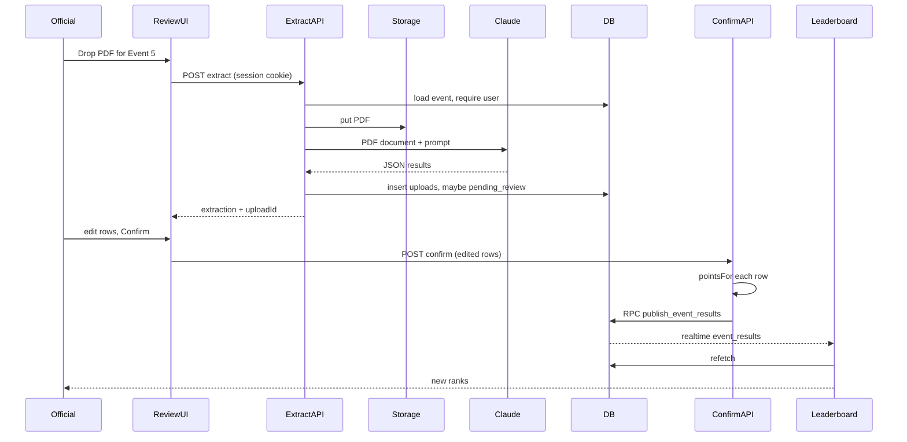

# PDF upload pipeline

This document is the full path from “official drops a result PDF” to “every leaderboard tab shows new points.” Nothing on the public scoreboard changes until **Confirm & Publish**.

See also: [Architecture](./ARCHITECTURE.md) · [Features](./FEATURES.md)

---

## 1. Pipeline at a glance

```
Admin selects an event
        │
        ▼
Uploads that event’s result PDF  (or, in development, loads the Event 5 JSON fixture)
        │
        ▼
POST /api/events/{id}/extract
        │
        ├── 1. Require logged-in official
        ├── 2. Store PDF in Supabase Storage (result-pdfs/{eventId}/{timestamp}-{name}.pdf)
        ├── 3. Send PDF bytes to Claude (document understanding)
        ├── 4. Parse STRICT JSON: names, team codes, places, times/status
        ├── 5. Insert uploads row (raw_extraction, confirmed = false)
        └── 6. If event is not already confirmed → status = pending_review
        │
        ▼
Browser shows an editable review table
        │
        ├── Official fixes names / teams / DNS-DQ
        ├── Unknown team codes highlighted red — Confirm stays blocked
        └── Preview column shows points that WILL be awarded
        │
        ▼
Official clicks Confirm & Publish
        │
        ▼
POST /api/events/{id}/confirm
        │
        ├── Validate body (Zod)
        ├── Map team codes → team_id
        ├── Compute points_awarded per row (lib/points.ts)
        └── RPC publish_event_results
                ├── reject if already confirmed and replace = false
                ├── DELETE old event_results for this event
                ├── INSERT new rows
                ├── events.status = confirmed
                └── uploads.confirmed = true
        │
        ▼
Postgres change on event_results
        │
        ▼
Supabase Realtime  →  every open LeaderboardBoard refetches  →  ranks update
```

**Important:** extraction does **not** write `event_results` and does **not** award points. A bad Claude read cannot hit the scoreboard unless an official confirms it.

---

## 2. Step-by-step: extract

### 2.1 Who can call it

`POST /api/events/[eventId]/extract`

- `requireUser()` uses the Supabase session cookie. No user → `401`.
- Only officials who can sign in (accounts you create in Supabase Auth).

### 2.2 Input

`multipart/form-data`:

| Field | When |
| --- | --- |
| `file` | A `application/pdf` result sheet |
| `useFixture=true` | Development only. Loads `fixtures/event-5-results.json` instead of Claude |

The UI also allows **manual rows** after extract (add/remove/edit). If Claude is down, officials can still type the table and publish; extract is the fast path, not the only path. Publishing does not require a PDF if the table is filled by hand **after** a prior extract, or after fixture load. A first visit with an empty table still needs extract, fixture, or the official adding rows then… wait: confirm API does not require `uploadId`. So after adding rows manually on a blank table, Confirm can work **without** extract, as long as team codes are valid. Extract is required only to fill the table from a PDF.

### 2.3 Storage (audit)

PDF bytes are uploaded to bucket `result-pdfs` at:

```
{eventId}/{unixMs}-{sanitizedFileName}.pdf
```

The path is stored on `uploads.file_path`. The audit page builds a public URL from that path so disputes can open the original sheet.

### 2.4 Claude call (`lib/extraction.ts`)

The server sends a Messages API request with two content blocks:

1. **Document** — PDF as base64, `media_type: application/pdf`
2. **Text** — extraction prompt asking for **strict JSON only**

Default model: `ANTHROPIC_MODEL` or `claude-sonnet-4-5-20250929`.

The prompt asks for:

```json
{
  "event_number": 5,
  "event_name": "200m Freestyle",
  "gender": "Men",
  "results": [
    {
      "position": 1,
      "name": "C. D. Ampavila",
      "team_code": "COL",
      "achievement": "02:08.03",
      "status": "finished"
    }
  ]
}
```

Rules encoded in the prompt (and later in scoring):

- `team_code` is the 3-letter university code, uppercase.
- `achievement` is the time **or** DNS / DQ / DNF / NS / WD.
- Non-finishers get that `status`; they never score.
- Do not invent rows.
- Positions beyond 6 may be included; they store with 0 points.

The SDK `messages.parse` uses a Zod schema (`zodOutputFormat`) so the model is steered toward that shape. If `parsed_output` is missing, the route falls back to reading text and `parseExtractionJson` (strips ```json fences if present).

Route timeout: `maxDuration = 60` seconds, Node runtime (not Edge), because of `Buffer` + the Anthropic SDK.

### 2.5 What is persisted after extract

A new `uploads` row:

- `event_id`
- `file_path`
- `raw_extraction` (the JSON, **before** human edits)
- `uploaded_by` (email or user id)
- `confirmed = false`

Event status:

- If the event was `not_uploaded` or `pending_review` → `pending_review`
- If it was already `confirmed` → **status stays confirmed** until a replace publish. Re-extracting a live event does not blank the scoreboard.

The API returns `{ uploadId, extraction }` to the browser. The review table is filled from `extraction.results`.

---

## 3. Step-by-step: human review

The review UI (`components/event-review.tsx`) is the safety layer.

For each row the official can edit:

| Column | Meaning |
| --- | --- |
| Position | Printed place (1–16, etc.). Null allowed for some non-finishers |
| Name | Swimmer or relay name as on the sheet |
| Team | Dropdown of seeded codes. Unknown codes stay visible in red |
| Time / code | e.g. `02:08.03` or `DNS` |
| Status | `finished` \| `DNS` \| `DQ` \| `DNF` \| `NS` \| `WD` |
| Pts | Live preview from `pointsFor` — **not yet written to the DB** |

Behaviours:

- **Unknown team** (not in `teams`): red border, listed above the publish button, Confirm disabled.
- **Add row / Remove**: for missed lines or extra DNS rows.
- **DQ after the fact:** set status to `DQ`. Points preview goes to 0. **Places below are not auto-promoted.** If the meet wants others shifted up, the official must edit positions by hand, then confirm.
- **Already confirmed:** checkbox **Replace existing result** is required. Without it, the client blocks and the RPC would also raise `already_confirmed`.

Nothing here updates `event_results`. Editing is local React state until Confirm.

---

## 4. Step-by-step: confirm and publish

`POST /api/events/[eventId]/confirm`  
JSON body:

```json
{
  "replace": false,
  "uploadId": 12,
  "results": [
    {
      "position": 1,
      "swimmer_name": "C. D. Ampavila",
      "team_code": "COL",
      "achievement": "02:08.03",
      "result_status": "finished"
    }
  ]
}
```

### 4.1 Validation

1. Session required.
2. Zod validates the body.
3. Event must exist.
4. `toPublishRows`:
   - Looks up each `team_code` (case-insensitive) in `teams`.
   - Unknown codes → HTTP 400 `{ unknownCodes: [...] }`.
   - Sets `points_awarded` with `pointsFor(event.event_type, position, result_status)`.

Relay events always use the relay table, regardless of Men/Women.

### 4.2 Atomic write

`supabase.rpc("publish_event_results", { p_event_id, p_replace, p_upload_id, p_rows })`

Inside one Postgres transaction (row lock on the event):

| Situation | Result |
| --- | --- |
| First publish | Delete (no-op) + insert + status confirmed |
| Re-publish without replace | Exception → HTTP 409 |
| Re-publish with replace | Delete previous rows for **this event only** + insert new points |

Other events’ points are untouched. Overall standings are the sum of remaining `event_results` after this swap.

### 4.3 Example: Event 5 individual

| Place | Team | Status | Points |
| --- | --- | --- | --- |
| 1 | COL | finished | 7 |
| 2 | SAB | finished | 5 |
| 6 | RUH | finished | 1 |
| 16 | WAY | DNS | 0 |

COL men’s total increases by 7; overall by 7. Women’s column unchanged.

If later COL’s winner is DQ’d and the official replaces:

- COL’s 7 for this event is removed (row deleted, new row with 0).
- SAB does **not** automatically receive 7 unless the official also changes SAB to position 1.

---

## 5. Step-by-step: live leaderboard

1. RPC insert/delete fires `postgres_changes` on `event_results` (and the event status update on `events`).
2. Every browser subscribed to channel `live-standings` runs a refetch.
3. `rankStandings(teams, results)`:
   - **Overall tab:** all results.
   - **Men / Women:** results whose event `gender` matches.
4. Rank, team badge, points re-render. “Last updated” resets to just now.

No WebSocket code of our own — Supabase Realtime is the socket.

---

## 6. What the parser is expected to handle

Sample sheet shape (also in `Results/DAY 01 - EVENT 05.pdf`):

```
Event 5 Men 200 LC Meter Free Style
Position  Name                    Team  Achievement
1         C. D. Ampavila          COL   02:08.03
2         G. G. A. M. S. Gamage   SAB   02:16.46
...
16        R. C. P. T. B. Ariyawansa  WAY  DNS
```

| Code | Meaning | Scores? |
| --- | --- | --- |
| (time) | Finished | Yes if place 1–6 |
| DNS | Did not start | No |
| DQ | Disqualified | No |
| DNF | Did not finish | No |
| NS / WD | No show / withdrawn | No |

Claude is used **because** sheet layout varies. A handwritten PDF table parser would break between events. The human review step is mandatory so a misread team code cannot publish.

---

## 7. Failure modes

| Failure | What the official sees | Scoreboard |
| --- | --- | --- |
| Not logged in | 401 / redirect to login | Unchanged |
| Not a PDF | Error toast/message | Unchanged |
| Storage upload fails | Error, no extract | Unchanged |
| Missing `ANTHROPIC_API_KEY` | Extract error | Unchanged |
| Claude timeout / bad JSON | Extract error | Unchanged |
| Unknown team on review | Red row, Confirm disabled | Unchanged |
| Confirm without replace on a live event | 409 / checkbox required | Unchanged |
| Network drop after extract, before confirm | Draft in `uploads`, event `pending_review` | Unchanged until they return and confirm |

In development, **Load Event 5 fixture** bypasses Claude so scoring can be tested offline.

---

## 8. Sequence diagram


